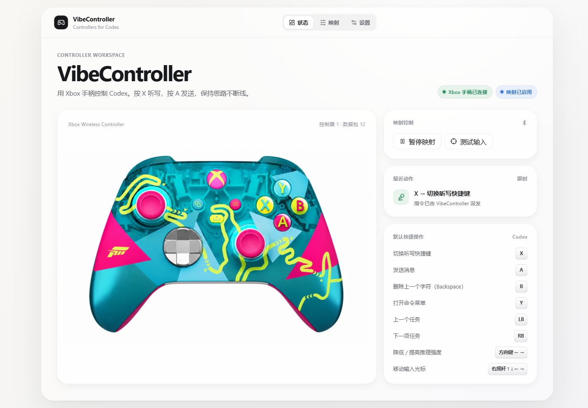
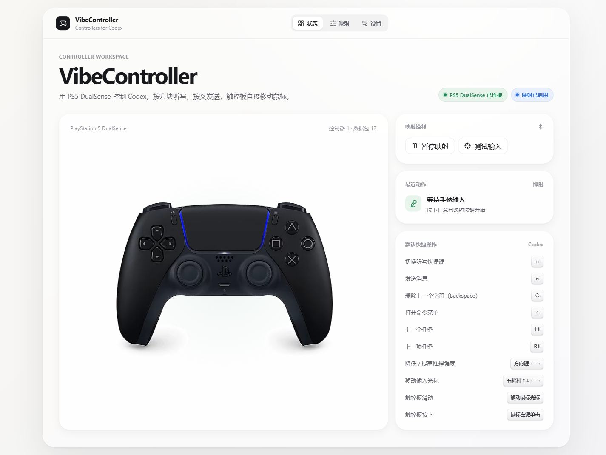
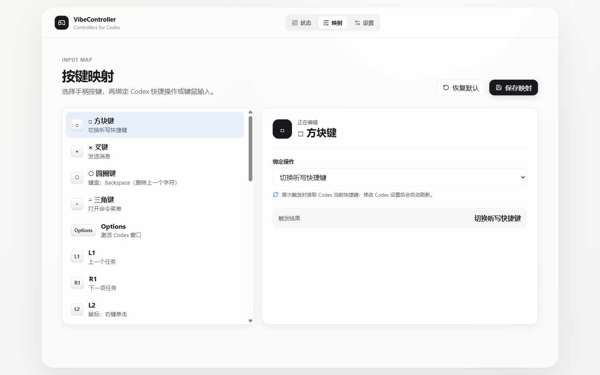

# VibeController

<div align="center">

**把 Xbox / PS5 手柄变成 Codex 的轻量遥控器。**<br>
**Turn an Xbox or PS5 controller into a lightweight remote for Codex.**

[](https://github.com/Mrjie7205/VibeController/actions/workflows/ci.yml)
[](https://github.com/Mrjie7205/VibeController/releases/latest)
[](LICENSE)

[简体中文](#简体中文) · [English](#english)

</div>



<a id="简体中文"></a>

## 简体中文

VibeController 是一款面向 Windows 的开源桌面工具。它读取 Xbox Series X|S 或 PS5 DualSense 手柄输入，再将按键、摇杆和触控板转换为 Codex 操作、键盘快捷键或鼠标事件。它不会接管语音识别：听写仍由 Codex 桌面端和电脑麦克风完成。

### 功能亮点

- 支持 Xbox Wireless Controller（XInput，控制器 1–4）和 PS5 DualSense（USB / 蓝牙 HID）。
- Codex 语义动作不是写死的快捷键：首次触发时读取 Codex 当前快捷键，并在配置变化后自动刷新。
- 支持听写、发送、命令菜单、任务/最近任务/标签页切换和推理强度调节。
- 左摇杆移动鼠标，扳机键点击；DualSense 触控板移动鼠标，按下执行左键单击。
- 右摇杆模拟方向键，可按住连续移动输入框光标。
- 默认只在 Codex 位于前台时注入输入，另有暂停映射和无注入测试模式。
- 本地 JSON 配置、系统托盘、自动重连和开机启动选项。

| PS5 DualSense | 按键映射 |
| --- | --- |
|  |  |

### 下载与安装

要求：Windows 10 22H2 或 Windows 11，x64。发布包已包含 .NET 运行时，但仍需要 [Microsoft Edge WebView2 Runtime](https://developer.microsoft.com/microsoft-edge/webview2/)；Windows 11 通常已预装。

1. 从 [Releases](https://github.com/Mrjie7205/VibeController/releases/latest) 下载 `VibeController-v1.0.0-win-x64.zip` 和同名 `.sha256` 文件。
2. 可选但推荐：执行 `Get-FileHash .\VibeController-v1.0.0-win-x64.zip -Algorithm SHA256`，与校验文件比较。
3. 完整解压 ZIP，不要直接在压缩包内运行。
4. 在 Windows 中通过蓝牙、USB 或 Xbox Wireless Adapter 连接手柄。
5. 运行 `VibeController.App.exe`，在“设置”中选择 Xbox 或 PS5，再用“测试输入”确认按键。
6. 启动 Codex；按 Menu / Options 激活窗口，退出测试模式后即可执行映射。

当前二进制尚未进行代码签名，因此 Windows SmartScreen 可能显示警告。请只从本仓库 Release 下载并核对 SHA-256。

### Codex 快捷键自动同步

当映射选择的是 Codex 内置操作时，VibeController 会在该操作首次使用时读取：

- `$CODEX_HOME\keybindings.json`；或
- 未设置 `CODEX_HOME` 时的 `%USERPROFILE%\.codex\keybindings.json`。

用户自定义绑定优先于 Codex 默认绑定；文件改变后会自动重新读取。如果 Codex 中明确取消了某项绑定、该操作没有默认快捷键，或快捷键格式暂不支持，VibeController 会在界面显示错误，而不会发送一个过时的固定按键。

Codex 当前通常未给“切换听写”和“提高/降低推理强度”分配默认快捷键。第一次使用这些动作前，请在 **Codex → 设置 → 键盘快捷键** 中为它们设置普通组合键。其他用户可以使用不同组合键，无需在 VibeController 里重复配置。

### 默认映射

| Xbox | PS5 | 输出 / Codex 功能 |
| --- | --- | --- |
| X | □ 方块 | 切换听写（读取 Codex 当前绑定） |
| A | × 叉 | 发送消息（读取 `composer.submit`，默认 `Enter`） |
| B | ○ 圆圈 | `Backspace`，删除上一个字符 |
| Y | △ 三角 | 打开命令菜单（读取 Codex 当前绑定） |
| Menu | Options | 激活正在运行的 Codex 窗口 |
| LB / RB | L1 / R1 | 上一个任务 / 下一个任务（读取 Codex 当前绑定） |
| 十字键 ← / → | 十字键 ← / → | 降低 / 提高推理强度（读取 Codex 当前绑定） |
| 十字键 ↑ / ↓ | 十字键 ↑ / ↓ | 键盘 `ArrowUp` / `ArrowDown` |
| 右摇杆 | 右摇杆 | 键盘四方向键，按住自动重复 |
| 左摇杆 | 左摇杆 | 移动鼠标光标 |
| RT / LT | R2 / L2 | 鼠标左键 / 右键单击 |
| — | 触控板滑动 / 按下 | 移动鼠标 / 鼠标左键单击 |
| View、L3、R3 | Create、L3、R3 | 默认未分配，可在映射页选择动作 |

“上一个/下一个最近查看的任务”和“上一个/下一个标签页”也在映射动作列表中，但默认不占用手柄按键。

### 工作原理

```text
Xbox XInput / DualSense HID
          ↓
统一的手柄输入事件
          ↓
可编辑映射 + Codex 快捷键解析
          ↓
Codex 前台安全检查
          ↓
Windows 键盘 / 鼠标 / 窗口操作
```

这是 Windows 输入映射工具，不依赖 Codex 私有 API。设置保存于 `%LOCALAPPDATA%\VibeController\settings.json`。应用不请求麦克风权限，不录音，也不读取或保存 Codex 对话文本。

### 从源码构建

需要 .NET SDK `8.0.423`（或 `global.json` 允许的兼容补丁版本）、Node.js 20+ 和 npm。

```powershell
git clone https://github.com/Mrjie7205/VibeController.git
cd VibeController
npm ci --prefix frontend
powershell -ExecutionPolicy Bypass -File .\scripts\test.ps1
powershell -ExecutionPolicy Bypass -File .\scripts\build.ps1
```

自包含输出位于 `artifacts\win-x64`。生成与官方 Release 相同结构的 ZIP：

```powershell
powershell -ExecutionPolicy Bypass -File .\scripts\package-release.ps1 -Version 1.0.0
powershell -ExecutionPolicy Bypass -File .\scripts\smoke-test-release.ps1 -Version 1.0.0
```

架构、开发约定和 PR 要求见 [CONTRIBUTING.md](CONTRIBUTING.md)。实体设备测试见 [硬件验收清单](docs/testing/hardware-checklist.md)。

### 当前限制与路线图

- 仅支持 Windows x64；暂未提供安装器、自动更新或代码签名。
- Xbox 走 XInput；部分系统保留键（如 Guide）不作为核心输入。
- DualSense 的 USB/蓝牙报告解析和触控板行为已有自动化测试，但不同固件与蓝牙适配器仍需要更多实体设备反馈。
- 未来计划包括 TCL 遥控器、配置档案、组合/长按动作以及更多通用 HID 设备。

### 许可证与声明

源代码以 [MIT License](LICENSE) 发布。控制器图片、商标和第三方材料的权利说明见 [THIRD_PARTY_NOTICES.md](THIRD_PARTY_NOTICES.md)。VibeController 是非官方社区项目，与 OpenAI、Microsoft 或 Sony 无隶属、赞助或背书关系。

---

<a id="english"></a>

## English

VibeController is an open-source Windows desktop utility that turns input from an Xbox Series X|S controller or PS5 DualSense into Codex actions, keyboard shortcuts, and mouse events. It does not perform speech recognition itself: dictation remains entirely inside the Codex desktop app and uses your computer's microphone.

### Highlights

- Xbox Wireless Controller support through XInput (controller slots 1–4).
- PS5 DualSense support through native Windows USB/Bluetooth HID, including the touchpad.
- Codex semantic actions resolve the user's current Codex shortcuts on first use and refresh after the file changes—no universal hard-coded shortcut assumptions.
- Dictation, submit, command menu, thread/recent-thread/tab navigation, and reasoning-effort actions.
- Left stick mouse movement, trigger clicks, right-stick arrow-key repeat, and DualSense touchpad mouse control.
- Codex-foreground guard by default, plus pause and non-injecting input-test modes.
- Local JSON settings, system tray behavior, device reconnect, and optional start with Windows.

### Download and install

Requirements: Windows 10 22H2 or Windows 11, x64. The release is self-contained and does not require a separate .NET runtime, but it still requires [Microsoft Edge WebView2 Runtime](https://developer.microsoft.com/microsoft-edge/webview2/), which is normally present on Windows 11.

1. Download `VibeController-v1.0.0-win-x64.zip` and its `.sha256` file from [Releases](https://github.com/Mrjie7205/VibeController/releases/latest).
2. Optionally verify it with `Get-FileHash .\VibeController-v1.0.0-win-x64.zip -Algorithm SHA256`.
3. Extract the complete archive; do not run the app from inside the ZIP.
4. Pair or connect the controller through Bluetooth, USB, or Xbox Wireless Adapter.
5. Run `VibeController.App.exe`, choose Xbox or PS5 in Settings, and confirm inputs in Test Input mode.
6. Start Codex. Use Menu / Options to focus it, exit Test Input mode, and use the mappings.

The v1.0.0 binaries are currently unsigned, so Windows SmartScreen may warn. Download only from this repository's Release page and verify the SHA-256 checksum.

### Codex shortcut synchronization

For a Codex action, VibeController reads the shortcut on first use from `$CODEX_HOME\keybindings.json`, or `%USERPROFILE%\.codex\keybindings.json` when `CODEX_HOME` is unset. Custom Codex bindings override defaults and the file is reloaded after it changes.

If an action is explicitly unbound, has no Codex default, or uses an unsupported accelerator format, VibeController reports the problem instead of injecting a stale fallback. Codex commonly has no default binding for **Toggle Dictation** or **Increase/Decrease Reasoning Effort**; bind those actions once under **Codex → Settings → Keyboard Shortcuts**. Each user may choose different combinations.

### Default mappings

| Xbox | PS5 | Output / Codex action |
| --- | --- | --- |
| X | Square □ | Toggle dictation (current Codex binding) |
| A | Cross × | Submit (`composer.submit`; `Enter` by default) |
| B | Circle ○ | `Backspace` |
| Y | Triangle △ | Open command menu (current Codex binding) |
| Menu | Options | Focus the running Codex window |
| LB / RB | L1 / R1 | Previous / next thread (current Codex binding) |
| D-pad ← / → | D-pad ← / → | Decrease / increase reasoning effort (current Codex binding) |
| D-pad ↑ / ↓ | D-pad ↑ / ↓ | Keyboard `ArrowUp` / `ArrowDown` |
| Right stick | Right stick | Four arrow keys with hold-to-repeat |
| Left stick | Left stick | Move the mouse pointer |
| RT / LT | R2 / L2 | Left / right mouse click |
| — | Touchpad move / press | Move mouse / left click |
| View, L3, R3 | Create, L3, R3 | Unassigned by default |

Previous/next recently viewed thread and previous/next tab are also available in the action picker without occupying a default controller button.

### How it works, privacy, and safety

VibeController normalizes XInput/HID reports, applies the editable mapping, resolves Codex shortcuts, checks the foreground-window policy, and injects ordinary Windows keyboard/mouse input. It does not use a private Codex API.

Settings stay in `%LOCALAPPDATA%\VibeController\settings.json`. VibeController does not request microphone access, record audio, or read/store Codex conversation text. The default foreground guard prevents accidental input into other apps; global mode is available but should be used deliberately.

### Build from source

Install .NET SDK `8.0.423` (or a compatible patch allowed by `global.json`), Node.js 20+, and npm.

```powershell
git clone https://github.com/Mrjie7205/VibeController.git
cd VibeController
npm ci --prefix frontend
powershell -ExecutionPolicy Bypass -File .\scripts\test.ps1
powershell -ExecutionPolicy Bypass -File .\scripts\build.ps1
```

The self-contained publish output is written to `artifacts\win-x64`. To create the distributable ZIP and checksum:

```powershell
powershell -ExecutionPolicy Bypass -File .\scripts\package-release.ps1 -Version 1.0.0
powershell -ExecutionPolicy Bypass -File .\scripts\smoke-test-release.ps1 -Version 1.0.0
```

See [CONTRIBUTING.md](CONTRIBUTING.md) for architecture and pull-request guidance, and the [hardware checklist](docs/testing/hardware-checklist.md) for physical-device validation.

### Limitations and roadmap

- Windows x64 only; no installer, automatic updater, or code-signing certificate yet.
- Xbox uses XInput, so OS-reserved buttons such as Guide are not core inputs.
- DualSense USB/Bluetooth parsing and touchpad behavior are covered by automated tests, while more real-world firmware and adapter reports are welcome.
- Planned directions include TCL remotes, profiles, chord/hold actions, and additional generic HID devices.

### License and notice

Source code is available under the [MIT License](LICENSE). See [THIRD_PARTY_NOTICES.md](THIRD_PARTY_NOTICES.md) for controller imagery, trademarks, and dependency notices. VibeController is an unofficial community project and is not affiliated with, sponsored by, or endorsed by OpenAI, Microsoft, or Sony.
